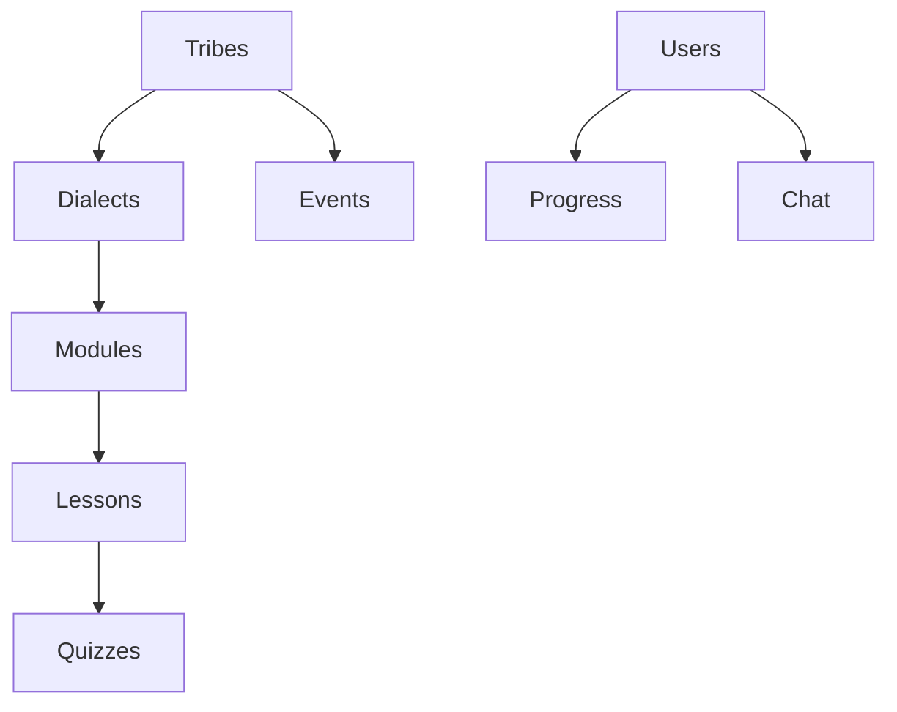

# **Database Design Document**  
**Tribal Language Learning Application**  

---

## **1. Introduction**  
This document outlines the complete database schema for a tribal language preservation platform, designed to support multiple dialects, adaptive learning modules, and community engagement features. Built with MongoDB, the system emphasizes cultural preservation, scalable architecture, and intuitive user experiences.

---

## **2. Collections Schema**  

### **2.1 Users Collection**  
*Stores authentication and role management*  
```javascript
{
  _id: ObjectId(),
  email: { type: String, unique: true, required: true },
  password: { type: String, required: true }, // Hashed
  role: { 
    type: String, 
    enum: ["learner", "instructor", "elder", "admin"], 
    default: "learner" 
  },
  tribe_id: { type: ObjectId, ref: "Tribes", required: true },
  dialect_id: { type: ObjectId, ref: "Dialects", required: true },
  created_at: ISODate("2024-03-15T00:00:00Z")
}
```

### **2.2 Profiles Collection**  
*1:1 relationship with Users (Extended user details)*  
```javascript
{
  _id: ObjectId(),
  user_id: { 
    type: ObjectId, 
    ref: "Users", 
    unique: true, 
    required: true 
  },
  full_name: "Jean Dupont",
  phone: "+237690123456",
  avatar_url: "profile.jpg",
  learning_prefs: {
    daily_goal: 30, // Minutes
    notify_method: ["push", "email"]
  },
  created_at: ISODate("2024-03-15T00:00:00Z")
}
```

### **2.3 Tribes Collection**  
*Tribal group metadata*  
```javascript
{
  _id: ObjectId(),
  name: { type: String, unique: true }, // E.g., "Bankon"
  region: "Littoral",
  language_code: "A40", // ISO 639-3
  moderators: [{ type: ObjectId, ref: "Users" }],
  created_at: ISODate("2024-03-15T00:00:00Z")
}
```

### **2.4 Dialects Collection**  
*Language variations within tribes*  
```javascript
{
  _id: ObjectId(),
  tribe_id: { type: ObjectId, ref: "Tribes", required: true },
  name: "Coastal Bankon",
  phonetic_rules: ["m̀ → low tone", "ŋ → nasal"],
  is_primary: { type: Boolean, default: false },
  created_at: ISODate("2024-03-15T00:00:00Z")
}
```

### **2.5 Modules Collection**  
*Learning categories (e.g., "Greetings")*  
```javascript
{
  _id: ObjectId(),
  dialect_id: { type: ObjectId, ref: "Dialects", required: true },
  title: "Basic Greetings",
  difficulty: { 
    type: String, 
    enum: ["beginner", "intermediate", "advanced"] 
  },
  order: 1, // Sequence in curriculum
  icon_url: "greetings-icon.png",
  created_at: ISODate("2024-03-15T00:00:00Z")
}
```

### **2.6 Lessons Collection**  
*Individual learning units*  
```javascript
{
  _id: ObjectId(),
  module_id: { type: ObjectId, ref: "Modules", required: true },
  title: "Morning Greetings",
  content: {
    text: "Learn to say good morning",
    media: [
      { 
        type: "image", 
        url: "sunrise.jpg",
        caption: "Morning in Cameroon" 
      },
      { 
        type: "audio", 
        url: "mbolo.mp3",
        speaker: "Elder Ngoe",
        duration: 120 // Seconds
      }
    ]
  },
  created_at: ISODate("2024-03-15T00:00:00Z")
}
```

### **2.7 Quizzes Collection**  
*Adaptive assessments (Duolingo-style)*  
```javascript
{
  _id: ObjectId(),
  lesson_id: { type: ObjectId, ref: "Lessons", required: true },
  type: { 
    type: String, 
    enum: ["matching", "voice", "multiple_choice", "fill_blank"] 
  },
  quiz_rank: 1, // Difficulty tier
  config: {
    // Type-specific configuration
    matching: {
      pairs: [
        { native: "Mbɔ́lɔ́", translation: "Hello" },
        { native: "Mə̀sə́l", translation: "Thank you" }
      ],
      timeout: 30 // Seconds
    },
    voice: {
      target_phrase: "Mbɔ́lɔ́",
      sample_url: "hello-bankon.mp3",
      similarity_threshold: 0.8
    }
  },
  created_at: ISODate("2024-03-15T00:00:00Z")
}
```

### **2.8 Progress Collection**  
*User learning tracking*  
```javascript
{
  _id: ObjectId(),
  user_id: { type: ObjectId, ref: "Users", required: true },
  lesson_id: { type: ObjectId, ref: "Lessons", required: true },
  quiz_attempts: [
    {
      quiz_id: ObjectId(),
      score: 8.5, // Out of 10
      timestamp: ISODate(),
      details: {
        incorrect_answers: ["matched 'mə̀sə́' to 'please'"],
        time_used: 25 // Seconds
      }
    }
  ],
  completed: { type: Boolean, default: false },
  last_accessed: ISODate()
}
```

### **2.9 Chat Collection**  
*Learner-instructor communication*  
```javascript
{
  _id: ObjectId(),
  sender_id: { type: ObjectId, ref: "Users", required: true },
  receiver_id: { type: ObjectId, ref: "Users", required: true },
  message: "How do I pronounce this?",
  media_url: "voice-note.mp3", // Optional
  sent_at: ISODate("2024-03-15T00:00:00Z"),
  read_status: { type: Boolean, default: false }
}
```

### **2.10 Events Collection**  
*Tribal activity calendar*  
```javascript
{
  _id: ObjectId(),
  tribe_id: { type: ObjectId, ref: "Tribes", required: true },
  title: "Harvest Festival",
  description: "Annual celebration of yam harvest",
  date: ISODate("2024-08-15T00:00:00Z"),
  location: {
    name: "Central Village Square",
    coordinates: [9.7489, 13.3797] // [lat, long]
  },
  created_at: ISODate("2024-03-15T00:00:00Z")
}
```

---

## **3. Relationships & Architecture**  

### **3.1 Relationship Table**  
| Collection    | Connected To          | Relationship  | Index Strategy                  |
|---------------|-----------------------|---------------|----------------------------------|
| Users         | Tribes                | Many-to-One   | `{ tribe_id: 1 }`               |
| Users         | Dialects              | Many-to-One   | `{ dialect_id: 1 }`             |
| Profiles      | Users                 | 1:1           | `{ user_id: 1 }` (Unique)       |
| Dialects      | Tribes                | Many-to-One   | `{ tribe_id: 1 }`               |
| Modules       | Dialects              | Many-to-One   | `{ dialect_id: 1, order: 1 }`   |
| Lessons       | Modules               | Many-to-One   | `{ module_id: 1 }`              |
| Quizzes       | Lessons               | Many-to-One   | `{ lesson_id: 1 }`              |
| Progress      | Users + Lessons       | Many-to-Many  | `{ user_id: 1, lesson_id: 1 }`  |
| Chat          | Users (x2)            | Many-to-Many  | `{ sender_id: 1, receiver_id: 1 }` |
| Events        | Tribes                | Many-to-One   | `{ tribe_id: 1, date: 1 }`      |

### **3.2 Data Hierarchy**  


